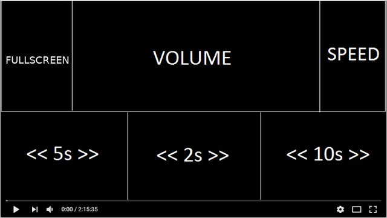

Extension for Firefox

Mouse & Video is an extension that helps you seek, change volume, brightness, speed and switch to fullscreen simply by scrolling the mouse wheel on the designated areas in the HTML5 video player. 

<h1>How it works</h1>

The video player will be divided like this:

These areas are hidden, but it shouldn't take long to get used to where each one is. Just scroll up or down on them to control the video playback.

It's also possible to change the video brightness by holding the 'Shift' key while scrolling anywhere within the player.

To be able to switch to fullscreen you have to follow the steps below:
<ul>
  <li>In the address bar type: <b>about:config</b> 
  <li>Click <b>I accept the risk!</b> 
  <li>In the Search form, type: <b>full-screen-api.allow-trusted-requests-only</b> and change it to <b>false</b>
  <li>Go to the extension's preferences page and click the checkbox to enable fullscreen
</ul>

Feel free to contribute!
